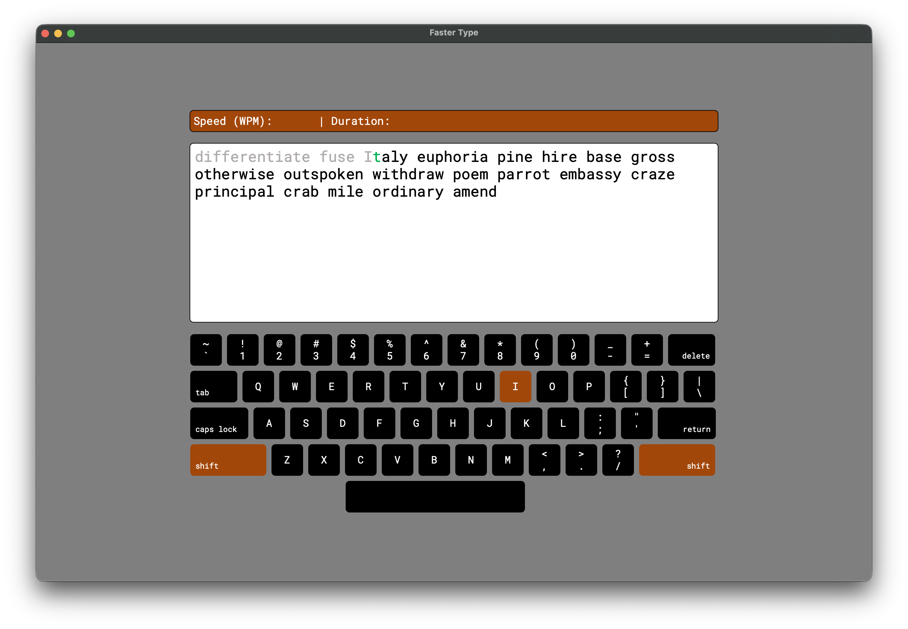

# TypeFaster

A lightweight, cross-platform typing speed test application built with Python and PyQt5. TypeFaster helps you improve your typing skills with real-time performance metrics, an interactive virtual keyboard, and curated word lists (4000 Essential Words).



## Features

- **Real-time Metrics:** Tracks Words Per Minute (WPM) and typing duration instantly.
- **Interactive Virtual Keyboard:** Visually highlights pushed keys for better touch-typing feedback.
- **Color-Coded Text Block:** Provides immediate visual feedback for correct, incorrect, and upcoming characters.
- **Curated Corpus:** Includes a built-in scraper to generate practice words from the "4000 Essential English Words" collection.
- **Cross-Platform & Web Ready:** Run natively on macOS/Windows/Linux.

## Getting Started

1. Clone the repository and navigate to the project directory:
    ```bash
    git clone https://github.com/smhamidi/type_faster.git
    cd Type_Faster
    ```
2. Create a conda environment
    ```bash
    conda create --name type_faster python=3.12
    conda activate type_faster
    ```
3. Install the required dependencies:
    ```bash
    pip install -r requirements.txt
    ```
4. Run the application:
    ```bash
    python main.py
    ```

Have fun!